# Computer Architecture Report

## gem5 First Lab
The following lab is an introduction to gem5 simulator where we explore the basic configuration and performance metrics of different CPU models and memory types. This lab involves running simple simulations using the gem5 simulator and getting familiar with the workspace and the tools. The following numbers resemble to the answers to the questions of the projects.

**1.** From starter_se.py we observe:
- CPU Model: minor (-cpu: default atomic)
- CPU Frequency: 1GHz (-cpu-freq, default 1GHz)
- CPU Cores: 1 (num-cores)
- Memory Type: DDR3 1600 8x8 (mem-type)
- Memory Channels: 2 (mem-channels)
- Memory ranks per channel: None (mem-ranks)
- Physical Memory size: 2GB (mem-size)

**2.** From config.ini and config.json we evaluate:
- type=MinorCPU
- clock=1000 (ps) = 1 ns = 1GHz frequency
- numThreads=1 (cores)
- ranks_per_channel=2 (for DRAM)
- mem_ranges=0:2147483647 (2 GB address space)
- On stats.txt we observe:
    - a. sim_seconds is the number of seconds simulated.
    - b. sim_insts is the number of instructions simulated and host_inst_rate is the simulator instruction rate.
    - c. The total committed instruction number is 5027 (commitedInsts).
    - d. L2 cache was accessed 474 times (l2.overall_accesses). If I did not have that statistic, I would use L1 icache and dcache misses (icache.overall_misses, dcache.overall_misses) and sum them to find the total misses minus the miss status handler register hits (icache.overall_mshmr_hits, dcache.overall_mshr_hits) (30 + 0) on both icache and dcache (327+177-30=474 l2 accesses).

**3.** By reviewing the documentation at gem5.org and the file located in the vm gem5-rsk.pdf we find: 
- ##### Minor CPU
The MinorCPU is a flexible in-order processor model which was originally developed to support the Arm ISA, and is applicable to other ISAs as well. MinorCPU has a fixed four-stage in-order execution pipeline, while having configurable data structures and execute behavior; therefore it can be configured at the micro-architecture level to model a specific processor.

- ##### SimpleCPU
    The SimpleCPU is a purely functional, in-order model that is suited for cases where a detailed model is not necessary. This can include warm-up periods, client systems that are driving a host, or just testing to make sure a program works. It has recently been re-written to support the new memory system, and is now broken up into three classes.
    - BaseSimpleCPU
        - The BaseSimpleCPU serves several purposes: it holds architected state and stats common across the SimpleCPU models, defines functions for checking for interrupts, setting up a fetch request, handling pre-execute setup, handling post-execute actions, and advancing the PC to the next instruction. It is the parent class and cannot be used on its own.
    - AtomicSimpleCPU
        - The AtomicSimpleCPU is a simple, non-timing CPU model that executes instructions in a single cycle. It is useful for fast-forwarding simulations to a point of interest or for functional-only simulations where timing accuracy is not required.
    - TimingSimpleCPU
        - The TimingSimpleCPU is a simple, in-order CPU model that includes basic timing information. It is useful for simulations where timing accuracy is important but a detailed out-of-order model is not necessary.

- b. We observe that TimingSimpleCPU runs the program with an initial input of 5 terms at 45858000 ps, whereas the MinorCPU runs it at 39873000 ps. This is due to the architecture where MinorCPU is a more sophisticated model with a more efficient pipeline and better resource utilization, leading to faster execution times compared to the simpler TimingSimpleCPU.
- We will try to change the clock to 2GHz (--sys-clock 2GHz) and by typing (-mem-type --help) we get to choose from 'HBM_1000_4H_1x128', 'DRAMCtrl', 'DDR3_2133_8x8', 'HBM_1000_4H_1x64', 'GDDR5_4000_2x32', 'HMC_2500_1x32', 'LPDDR3_1600_1x32', 'WideIO_200_1x128', 'QoSMemSinkCtrl', 'DDR4_2400_8x8', 'DDR3_1600_8x8', 'DDR4_2400_4x16', 'DDR4_2400_16x4', 'SimpleMemory', 'LPDDR2_S4_1066_1x32'. We will use DDR4_2400_16x4 for test reasons, and due to limited time no other evaluations were conducted between all those models. The results are shown to the following array:

| Memory Type     | Clock Speed | CPU Model        | Execution Time (ps) |
|-----------------|-------------|------------------|---------------------|
| DDR3_1600_8x8   | 1GHz        | MinorCPU         | 45462000            |
| DDR3_1600_8x8   | 2GHz        | MinorCPU         | 42076000            |
| DDR4_2400_16x4  | 1GHz        | MinorCPU         | 44276000            |
| DDR4_2400_16x4  | 2GHz        | MinorCPU         | 40570500            |
| DDR3_1600_8x8   | 1GHz        | TimingSimpleCPU  | 60115000            |
| DDR3_1600_8x8   | 2GHz        | TimingSimpleCPU  | 57318000            |
| DDR4_2400_16x4  | 1GHz        | TimingSimpleCPU  | 59030000            |
| DDR4_2400_16x4  | 2GHz        | TimingSimpleCPU  | 56165500            |

From the results shown in the table, we can observe that increasing the clock speed from 1GHz to 2GHz consistently reduces the execution time for both MinorCPU and TimingSimpleCPU across all memory types. MinorCPU consistently outperforms TimingSimpleCPU in terms of execution time, which aligns with the expectation that MinorCPU has a more efficient pipeline and better resource utilization. The choice of memory type also impacts the execution time, with DDR4_2400_16x4 generally providing better performance compared to DDR3_1600_8x8 for both CPU models.

---

## gem5 Second Lab

### First Step
**1.** The following lab has as a goal to run some benchmarks over different CPU models and parameters and

- The information is obtained from config.ini:
    - L1 Data cache (system.cpu.dcache):
        - Size: 65536 bytes (64kB)
        - Associativity: 2-way
    - L1 Instruction cache (system.cpu.icache):
        - Size: 32768 bytes (32kB)
        - Associativity: 2-way
    - L2 cache (system.l2):
        - Size: 2097152 bytes (2MB)
        - Associativity: 8-way
    - Cache line size: 64 bytes

**2.** The result statistics are observed here:
| Benchmark  | Seconds Simulated | CPI | L1 D-Cache Miss Rate | L1 I-Cache Miss Rate | L2 Miss Rate |
|------------|-------------|----------------|--------------------------------------------|--------------------------------------------|------------------------------------|
| specbzip   | 0.083982    | 1.679650       | 0.014798                                   | 0.000077                                   | 0.282163                           |
| spechmmer  | 0.059396    | 1.187917       | 0.001637                                   | 0.000221                                   | 0.077760                           |
| speclibm   | 0.174671    | 3.493415       | 0.060972                                   | 0.000094                                   | 0.999944                           |
| specmcf    | 0.064955    | 1.299095       | 0.002108                                   | 0.023612                                   | 0.055046                           |
| specsjeng  | 0.513528    | 10.270554      | 0.121831                                   | 0.000020                                   | 0.999972                           |

The results can be observed with the following histograms:

    

        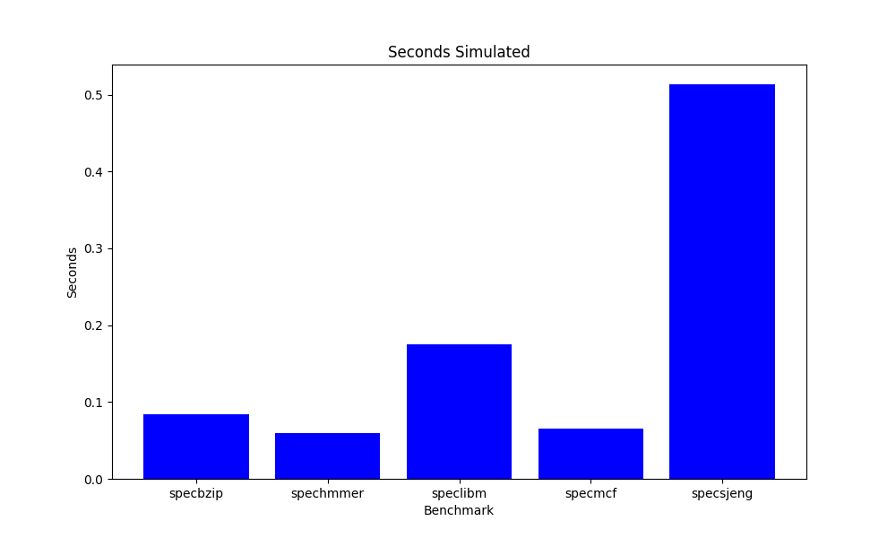
    

    

        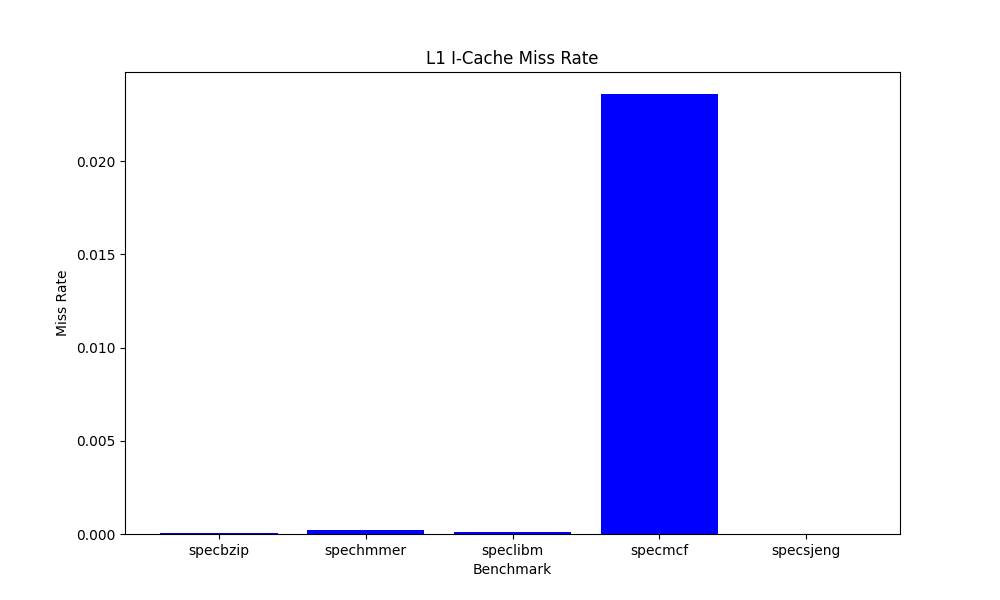
    

    

        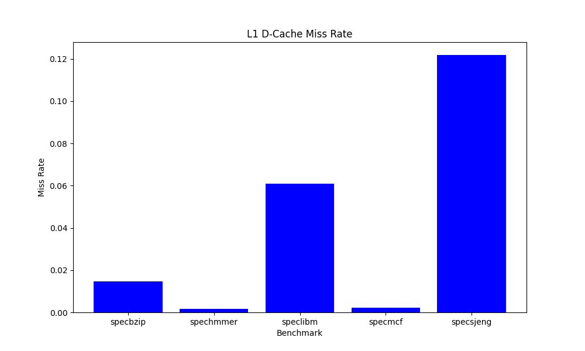
    

    

        
    

    

        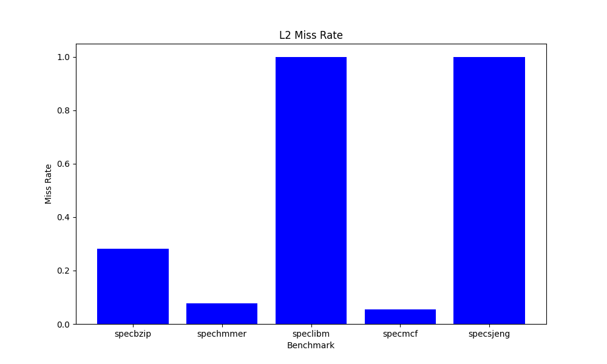
    

We observe that CPI dramatically increases the more L1 and L2 misses the benchmark has.

**3.** By variating the CPU clock at 1GHz and 3GHz respectively we get the following results:

**At 1 GHz:**
| Benchmark  | Seconds Simulated | CPI     | L1 D-Cache Miss Rate | L1 I-Cache Miss Rate | L2 Miss Rate |
|------------|-------------------|---------|----------------------|----------------------|--------------|
| specbzip   | 0.161025          | 1.610247| 0.014675             | 0.000077             | 0.282157     |
| spechmmer  | 0.118530          | 1.185304| 0.001629             | 0.000221             | 0.077747     |
| speclibm   | 0.262327          | 2.623265| 0.060971             | 0.000094             | 0.999944     |
| specmcf    | 0.127942          | 1.279422| 0.002108             | 0.023627             | 0.055046     |
| specsjeng  | 0.704056          | 7.040561| 0.121831             | 0.000020             | 0.999972     |

**At 3 GHz:**
| Benchmark  | Seconds Simulated | CPI     | L1 D-Cache Miss Rate | L1 I-Cache Miss Rate | L2 Miss Rate |
|------------|-------------------|---------|----------------------|----------------------|--------------|
| specbzip   | 0.058385          | 1.753291| 0.014932             | 0.000077             | 0.282166     |
| spechmmer  | 0.039646          | 1.190581| 0.001637             | 0.000221             | 0.077761     |
| speclibm   | 0.146433          | 4.397377| 0.060972             | 0.000094             | 0.999944     |
| specmcf    | 0.043867          | 1.317329| 0.002108             | 0.023609             | 0.055046     |
| specsjeng  | 0.449821          | 13.508136| 0.121831            | 0.000020             | 0.999972     |

Comparing the CPI and the simulated seconds between the 3 runs we observe:

    

        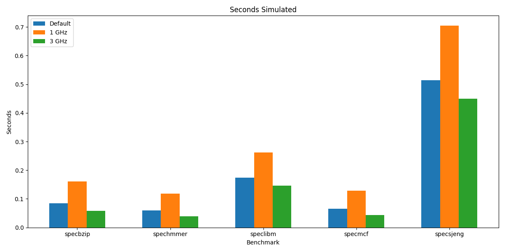
    

    

        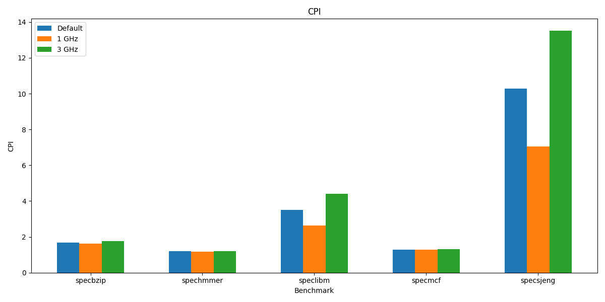
    

By observing the config.json file we see that in both 3 runs the system.clk_domain.clock remains constant at 1000 while the cpu_clk_domain.clock changes from 500 (ps which corresponds at 2GHz by default) to 1000 and 333 (1GHz and 3GHz accordingly). The separation happens due to the fact that there are different clock domains inside a CPU that can run at different speeds rather than the main memory and system clock. If we add another CPU the frequency we can use will be limited due to the bottleneck of the shared memory, as the two systems cannot produce more data than the memory can handle. The communication of data between the main memory and the CPU happens from L2 and this is why at 3GHz the CPI is higher, while the simulation time is lower. (each L2 cache misses is punished with more cycles at 3GHz as the bridge from the different clocks between it and the main memory in cycles becomes higher).

**4.** By changing the memory type to DDR3_2133_x64 and setting the clock to 2GHz, we observe:

| Benchmark  | Seconds Simulated (%) | CPI (%) |
|------------|------------------------|---------|
| specbzip   | -0.44%                 | -0.44%  |
| spechmmer  | -0.02%                 | -0.02%  |
| speclibm   | -1.80%                 | -1.80%  |
| specmcf    | -0.10%                 | -0.10%  |
| specsjeng  | -3.97%                 | -3.97%  |

This is logical due to the higher memory bandwidth and lower latency of DDR3_2133_x64 compared to DDR3_1800_x64, which results in improved performance and reduced execution time for the benchmarks.

### Second Step

**1.** From the values above to analyze the impact of each type we perform parametric analysis on values L1 D Size, L2 Size, L1 D Associativity, L2 Associativty and Cache Line Size by keeping all the values the same and varying only the one in execution. We excluded the L1 I analysis as the miss rate in the benchmarks above is too low, so we think that changes on that won't have great impact on CPI or time.
**2.** To reduce the time needed for all those we divided the number of instruction /100 with hope that the convergence to the real statistic value still happens and that we will have some insights on which parameters play the most crucial role. Some examples of parameters that do have an impact and do not are the cache line size and the L1 data size where from the parametric analysis we can observe which size drops the CPI significantly:

    

        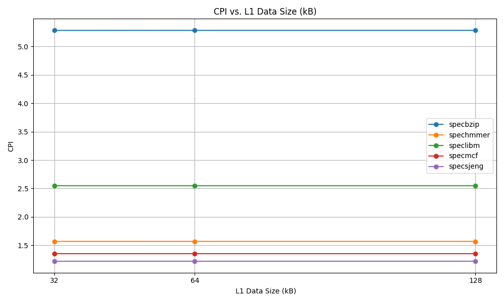
    

    

        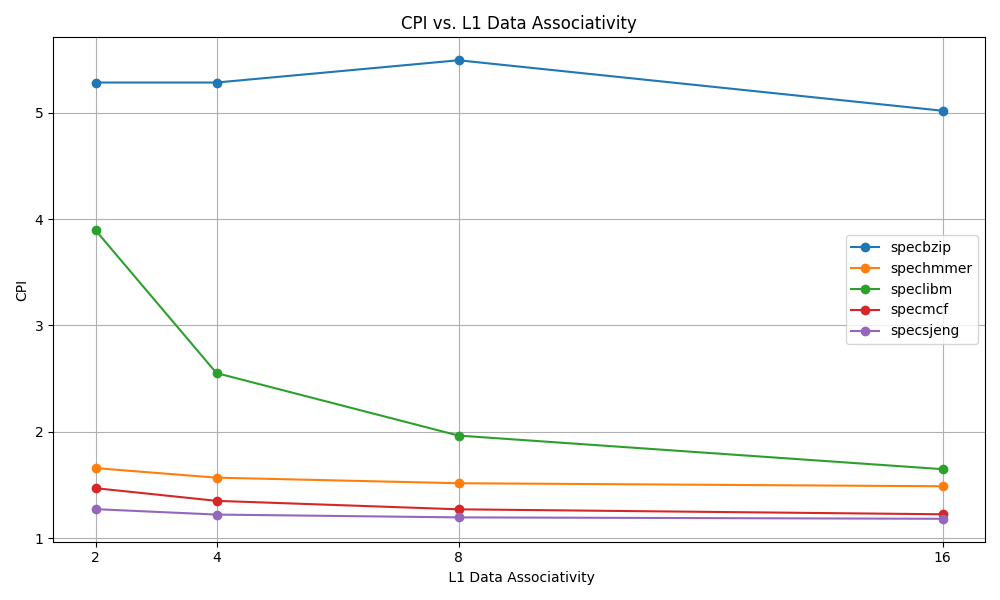
    

    

        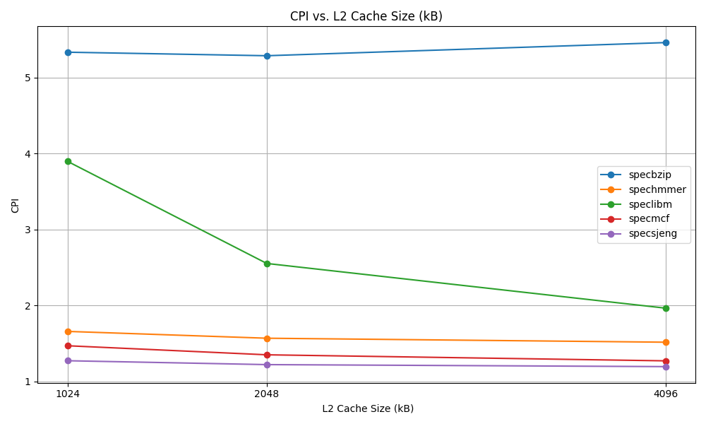
    

    

        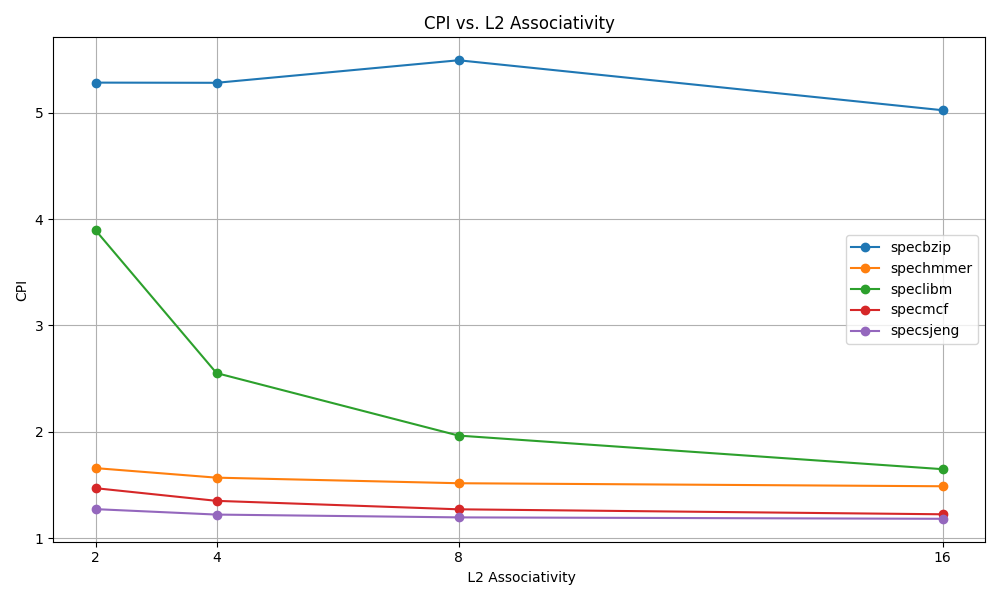
    

    

        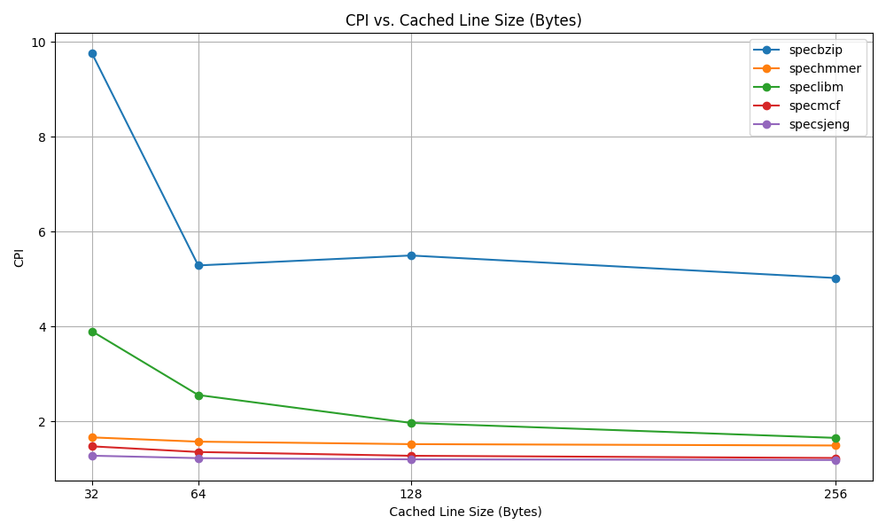
    

Given as a task to design a cost function and rerun specific benchmarks to obtain an optimum result (low CPI at most possible low cost) we consider the following facts from the bibliography (Computer Architecture: A Quantitive Approach):
Larger caches offer higher capacity but come with increased implementation costs and access latency. The cost of implementation grows approximately linearly with size, while latency increases logarithmically. L1 caches have a higher cost per unit size compared to L2 caches due to their tighter timing requirements and proximity to the processor core. Higher associativity in caches reduces conflict misses but increases complexity due to the number of comparators and multiplexing logic required, with costs growing roughly exponentially with associativity, especially for larger caches. Larger cache lines improve spatial locality but lead to higher memory bandwidth usage and potential overfetch, with a moderate cost impact mainly affecting data storage and fetching from memory.
Taking into consideration all that and the upper limits of the design, as well as commonly used values we construct the following cost function (between 0 and 200):
$$
\text{Cost} = 0.2 \cdot \text{L1\_I\_size} + 0.2 \cdot \text{L1\_D\_size} + 0.05 \cdot \text{L2\_size} + 5 \cdot (2^{\text{L1\_I\_assoc}} + 2^{\text{L1\_D\_assoc}} + 2^{\text{L2\_assoc}}) + 0.5 \cdot \text{line\_size}
$$

Then by taking a wide range of combinations we ended to the following ones:

| Combination       | L1 I Size (KB) | L1 D Size (KB) | L2 Size (KB) | L1 I Assoc | L1 D Assoc | L2 Assoc | Line Size (B) | Cost  |
|-------------------|----------------|----------------|--------------|------------|------------|----------|----------------|-------|
| Balanced Low      | 128            | 128            | 1024         | 2          | 2          | 4        | 32             | 72.4  |
| High L1           | 128            | 64             | 1024         | 4          | 4          | 4        | 64             | 82.8  |
| High Assoc        | 128            | 64             | 1024         | 8          | 8          | 8        | 32             | 116.4 |
| High Line         | 128            | 64             | 1024         | 4          | 4          | 4        | 128            | 89.6  |
| Max L1            | 128            | 128            | 1024         | 4          | 4          | 4        | 64             | 109.6 |
| Balanced          | 128            | 128            | 2048         | 4          | 4          | 8        | 64             | 124.8 |
| High L2           | 128            | 64             | 4096         | 4          | 4          | 8        | 64             | 146.4 |
| High Assoc        | 128            | 64             | 2048         | 8          | 8          | 8        | 64             | 140.8 |
| Line Focus        | 128            | 64             | 2048         | 4          | 4          | 8        | 256            | 163.2 |
| High L1/L2        | 128            | 128            | 2048         | 4          | 4          | 8        | 64             | 158.4 |
| High L1 Assoc     | 128            | 128            | 2048         | 8          | 8          | 8        | 64             | 188.8 |
| L2 Priority       | 128            | 64             | 4096         | 8          | 8          | 8        | 128            | 189.6 |
| Maximal           | 128            | 128            | 4096         | 16         | 16         | 16       | 256            | 200   |

By running the different benchmarks on those configurations we obtain:

    

        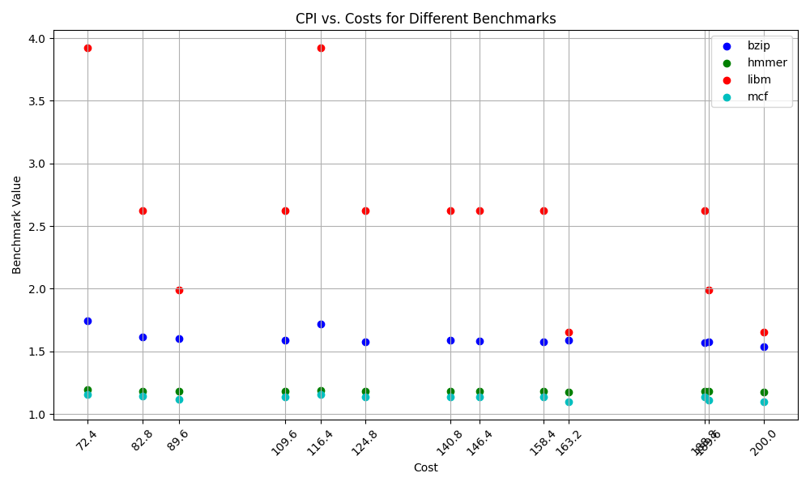
    

Therefore the optimal configuration by looking at the chart is:

| Combination       | L1 I Size (KB) | L1 D Size (KB) | L2 Size (KB) | L1 I Assoc | L1 D Assoc | L2 Assoc | Line Size (B) | Cost  |
|-------------------|----------------|----------------|--------------|------------|------------|----------|----------------|-------|
| High Line         | 128            | 64             | 1024         | 4          | 4          | 4        | 128            | 89.6  |